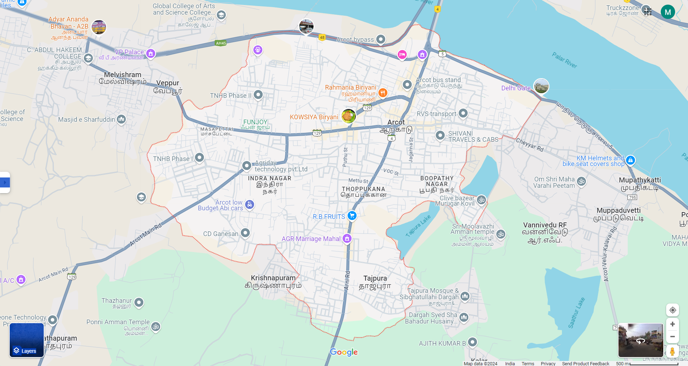

# Ex04 Places Around Me
## Date: 

## AIM
To develop a website to display details about the places around my house.

## DESIGN STEPS

### STEP 1
Create a Django admin interface.

### STEP 2
Download your city map from Google.

### STEP 3
Using ```<map>``` tag name the map.

### STEP 4
Create clickable regions in the image using ```<area>``` tag.

### STEP 5
Write HTML programs for all the regions identified.

### STEP 6
Execute the programs and publish them.

## CODE
```
map.html

<html>

<head>
<title>My City</title>
</head> 
<body>
    <h1 aligen="center"
<font align="center" color="red"><b>Arcot</b></font>
</h1>
<h3 align="center">
    <font color="blue"><b>Madhann Kumar V (24010027)</b></font>
</h3>
<center>



<map name="image-map">
    <area target="" alt="melvisharam" title="melvisharam" href="melvisharam.html" coords="1000,778,1111,852" shape="rect">
    <area target="" alt="veppur" title="veppur" href="veppur.html" coords="1198,655,69" shape="circle">
    <area target="" alt="krishnapuram" title="krishnapuram" href="krishnapuram.html" coords="950,700,913,539,1052,545,1089,589,1049,658,902,650" shape="poly">
    <area target="" alt="tajpura" title="mupaduvetti" href="mupaduvetti.html" coords="825,837,74" shape="circle">
    <area target="" alt="mupaduvetti" title="tajpura" href="tajpura.html" coords="954,352,808,264" shape="rect">
</map>
</center>
 </body>
  </html>

krishnapuram.html
<html>
    <body bgcolor="lightgreen">
        <font><h1 align="center">krishnapuram</h1></font>
        <font align="center" size="5"><p>
            <br>
        
            Likely a smaller settlement within the Ranipet district, close to the historical town of Arcot.
            This village may focus on agriculture as its primary livelihood, supported by the fertile lands of the Palar River basin.
            Its proximity to Arcot suggests cultural and historical influences from the Nawabs of Arcot era.
        </p></font>
    </body>
</html>

melvisharam.html
<html>
    <body bgcolor="lightred">
        <font><h1 align="center">melvisharam</h1></font>
        <font align="center" size="5"><p>
            <br>
           
            Melvisharam is a town located in the Vellore district of Tamil Nadu, India. It is known for its thriving leather tanning industry and is home to several small and medium-scale leather production units. The town has a rich cultural heritage and a diverse population, predominantly comprising Tamil-speaking communities.
        </p></font>
    </body>
</html>

mupaduvetti.html
<html>
    <body bgcolor="lightgray">
        <font><h1 align="center">mupaduvetti</h1></font>
        <font align="center" size="5"><p>
            <br>
            
            mupaduvetti is a lesser-known village located near Arcot in the Ranipet district of Tamil Nadu, India. The name "Mupaduvetti" is significant in Tamil, where "Muppadu" means "thirty" and "Vetti" could relate to land clearing or conquests. However, in this context, it most likely refers to a historical or cultural connection.
            Mupaduvetti is a small settlement close to the Arcot region, which is historically significant due to its role in the Carnatic Wars and its cultural heritage.
            It is surrounded by agricultural lands and smaller hamlets, reflecting the rural landscape of Tamil Nadu.
        </p></font>
    </body>
</html>

veppur.html
<html>
    <body bgcolor="lightblue">
        <font><h1 align="center">veppur</h1></font>
        <font align="center" size="5"><p>
            <br>
            
            Veppur near Arcot is a small village located in the Ranipet district of Tamil Nadu, India. This area is known for its rural charm and connection to the historically significant town of Arcot, which was a hub of power during the Nawabs of Carnatic rule
            Situated near Arcot town, which lies on the Palar River.
            Accessible by road from major towns like Vellore, Ranipet, and Chennai (via NH 48).
            Part of a region characterized by fertile lands and a strong rural economy.
        </p></font>
    </body>
</html>
```
## OUTPUT

.png>)
.png>)
.png>)
.png>)
.png>)


## RESULT
The program for implementing image maps using HTML is executed successfully.
